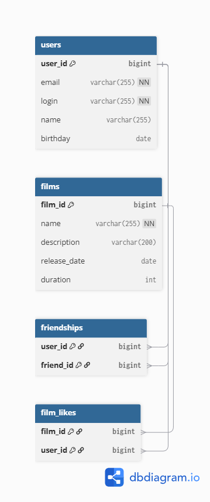

# Filmorate — социальная сеть для любителей кино

## Схема базы данных



## Описание таблиц

### users
Хранит пользователей.

| Поле | Тип | Ограничения | Описание |
|---|---|---|---|
| user_id | bigint | PK, increment | Уникальный идентификатор |
| email | varchar(255) | NOT NULL | Электронная почта |
| login | varchar(255) | NOT NULL | Логин |
| name | varchar(255) | — | Имя (если не задано, используется login) |
| birthday | date | — | Дата рождения |

### films
Хранит фильмы.

| Поле | Тип | Ограничения | Описание |
|---|---|---|---|
| film_id | bigint | PK, increment | Уникальный идентификатор |
| name | varchar(255) | NOT NULL | Название |
| description | varchar(200) | — | Описание |
| release_date | date | — | Дата выхода (≥ 28.12.1895) |
| duration | int | — | Продолжительность (минуты) |

### friendships
Связь «дружба» (M:N между users). Составной ключ (user_id, friend_id) — нельзя добавить друга дважды.

| Поле | Тип | Ограничения | Описание |
|---|---|---|---|
| user_id | bigint | PK, FK → users | Пользователь |
| friend_id | bigint | PK, FK → users | Друг |

### film_likes
Связь «лайк» (M:N между films и users). Составной ключ — один лайк от одного пользователя.

| Поле | Тип | Ограничения | Описание |
|---|---|---|---|
| film_id | bigint | PK, FK → films | Фильм |
| user_id | bigint | PK, FK → users | Кто поставил лайк |

## Примеры SQL-запросов

### Получить всех пользователей
```sql
SELECT * FROM users
```

### Получить пользователя по id
```sql
SELECT * FROM users WHERE user_id = 1
```

### Получить все фильмы
```sql
SELECT * FROM films;
```

### Получить фильм по id
```sql
SELECT * FROM films WHERE film_id = 1;
```

### Добавить друга (взаимно)
```sql
INSERT INTO friendships (user_id, friend_id) VALUES (1, 2);
INSERT INTO friendships (user_id, friend_id) VALUES (2, 1);
```

### Удалить друга (взаимно)
```sql
DELETE FROM friendships WHERE user_id = 1 AND friend_id = 2;
DELETE FROM friendships WHERE user_id = 2 AND friend_id = 1;
```

### Список друзей пользователя

```sql
SELECT u.*
FROM users u
JOIN friendships f ON u.user_id = f.friend_id
WHERE f.user_id = 1;
```

### Общие друзья двух пользователей
```sql
SELECT u.*
FROM users u
JOIN friendships f1 ON u.user_id = f1.friend_id
JOIN friendships f2 ON u.user_id = f2.friend_id
WHERE f1.user_id = 1 AND f2.user_id = 2;
```

### Поставить лайк
```sql
INSERT INTO film_likes (film_id, user_id) VALUES (1, 1);
```

### Убрать лайк
```sql
DELETE FROM film_likes WHERE film_id = 1 AND user_id = 1;
```

### Топ-10 популярных фильмов
```sql
SELECT f.*, COUNT(fl.user_id) AS like_count
FROM films f
LEFT JOIN film_likes fl ON f.film_id = fl.film_id
GROUP BY f.film_id
ORDER BY like_count DESC
LIMIT 10;
```

### Технологии
- Java 21
- Spring Boot 3.5.12
- Maven
- Lombok

### Автор

***Дмитрий Жук***  
***Студент 74й когорты Java***